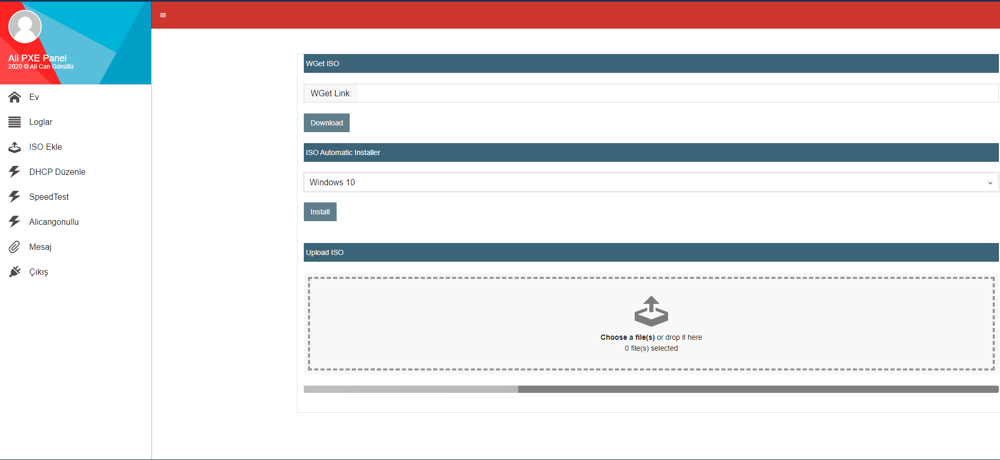
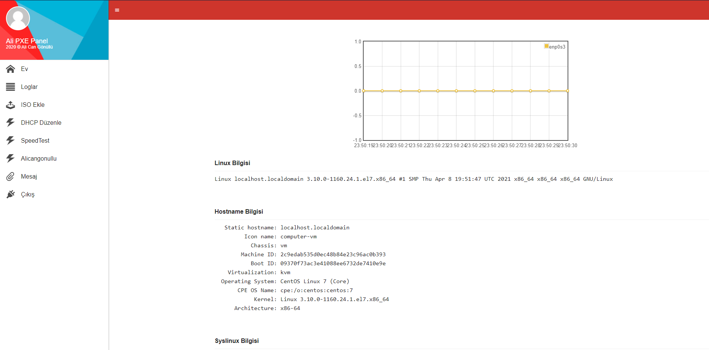
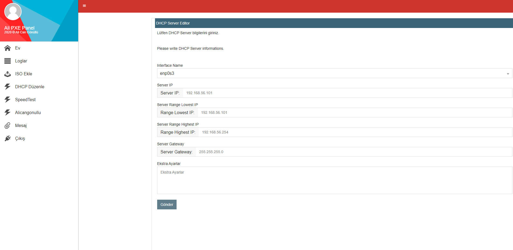
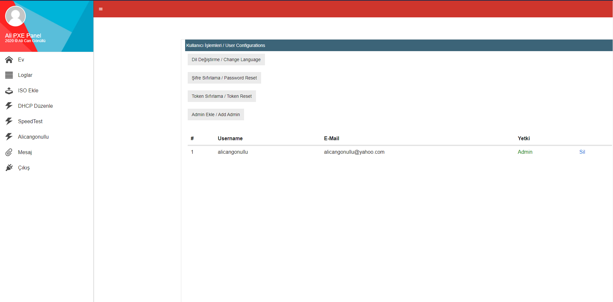
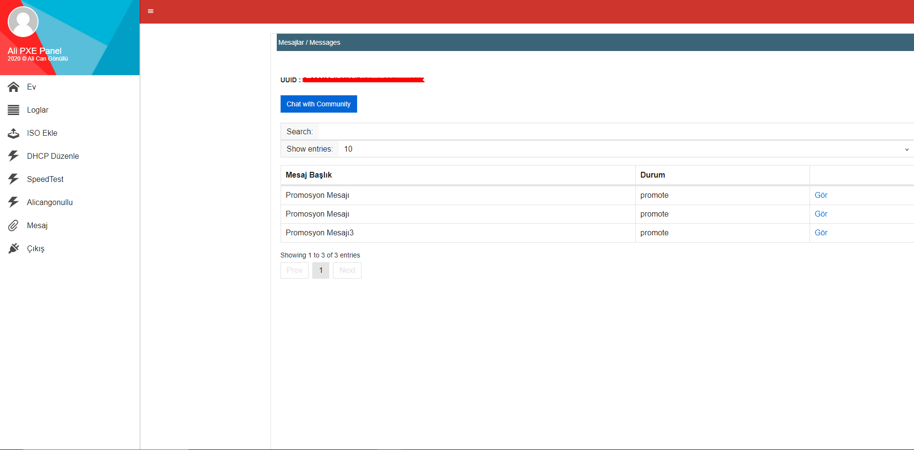
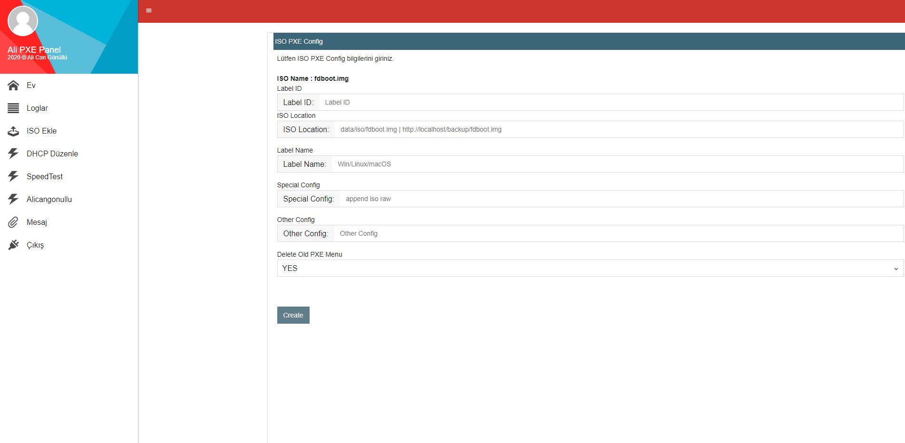

# CentVM PXE Web Server UI | PHP 7.2+

<b>CentVM PXE Web Server UI | PHP 7.2+</b>
 
 

<b>PXE ISO Upload & Download</b> 
 
<b>PXE ISO Information</b> 
 
<b>PXE DHCP Configuration</b> 
 
<b>PXE Admin Page</b> 
 
<b>PXE Message Page</b> 
 
<b>PXE Boot Page Generator</b> 
 

 
<pre>
NOTE : This program has been written for legal purposes. 
The author of this program is not responsible for illegal uses.
Required : PHP 7.2 and CentOS Linux

Default Username : alicangonullu
Default Password : 19742008
Default Token : 19742008
</pre>
 
